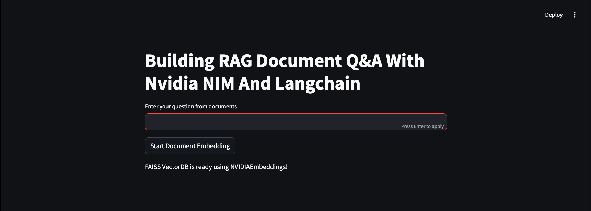
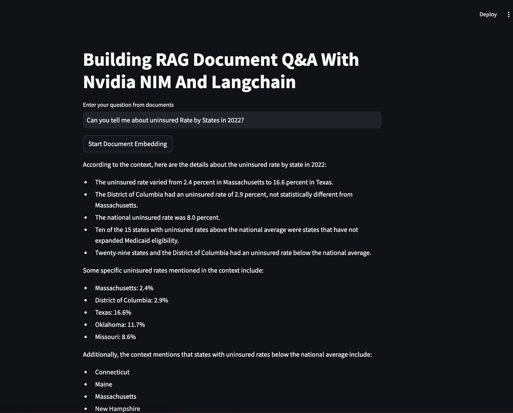
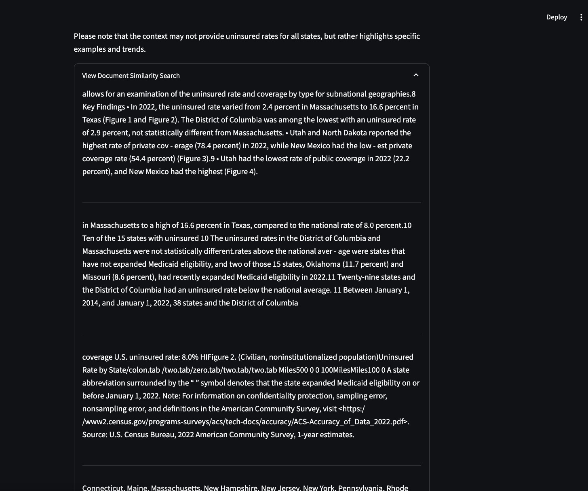

# nim-nvda 

## Building RAG Document Q&A With Nvidia NIM And Langchain

- Ingest PDFs from `us_census` directory into loader
- Load docs using loader.load()
- Divide all documents into chunks
- Convert all chunks to vector and store in the form of vector database

## Demo

